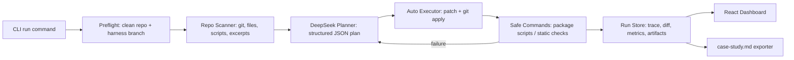

# DeepSeek Harness Lab

Local CLI + Web Dashboard for an agent harness that scans a real repo, asks DeepSeek for a structured plan, applies patches on a protected branch, runs validation, records a trace, and exports a case study.

This is a portfolio MVP for DeepSeek Harness product/developer interviews. It focuses on the product surface around autonomous coding: context packing, bounded execution, failure visibility, rollback, and review artifacts.

## What It Does

- `harness-lab run --repo <path> --task "<task>" --test "<command>" --mode auto`
- Creates `harness-lab/<runId>` from the target repo's current branch.
- Refuses dirty repos by default; use `--allow-dirty` only when intentional.
- Scans git state, file tree, package scripts, and high-signal candidate files.
- Uses DeepSeek by default via `DEEPSEEK_API_KEY` and model `deepseek-v4-flash`.
- Also supports Volcengine Ark / Claude Code style env vars: `ANTHROPIC_AUTH_TOKEN`, `ANTHROPIC_BASE_URL`, and `ANTHROPIC_MODEL`.
- Applies provider-generated unified diffs with `git apply --check` first.
- Runs allowlisted validation commands and retries up to 3 iterations.
- Writes `.harness-lab/runs/<runId>/run.json`, patches, diff, context pack, and `case-study.md`.
- Serves a local dashboard at `http://localhost:5173`.

## Architecture



## Quick Start

```bash
npm install
npm run typecheck
npm test
npm run build
```

Run with DeepSeek:

```bash
export DEEPSEEK_API_KEY="..."
export DEEPSEEK_BASE_URL="https://api.deepseek.com"
npm run harness -- run \
  --repo /path/to/your/repo \
  --task "Add a project card and validate the page" \
  --test "npm run build" \
  --mode auto
```

Run with a Volcengine Ark Claude Code-compatible endpoint already configured in your shell:

```bash
# Uses ANTHROPIC_AUTH_TOKEN, ANTHROPIC_BASE_URL, and ANTHROPIC_MODEL.
npm run harness -- run \
  --repo /path/to/your/repo \
  --task "Fix a focused issue and validate it" \
  --test "npm test" \
  --mode auto
```

Run offline with the deterministic mock provider:

```bash
npm run harness -- run \
  --repo /path/to/git/repo \
  --task "Fix the calculator add function so tests pass" \
  --test "npm test" \
  --mode auto \
  --provider mock
```

Start the local dashboard:

```bash
npm run dev
```

Open `http://localhost:5173`.

## DeepSeek API

The real provider supports two gateway shapes:

- DeepSeek OpenAI-compatible Chat Completions API at `https://api.deepseek.com/chat/completions`.
- Anthropic-compatible gateways such as Volcengine Ark configurations used by Claude Code.

The default model is `deepseek-v4-flash`. DeepSeek's public docs currently note that older names including `deepseek-chat` and `deepseek-reasoner` are in a deprecation window ending on 2026-07-24, so this project keeps the model configurable through `DEEPSEEK_MODEL` or `ANTHROPIC_MODEL`.

Reference: [DeepSeek API Docs](https://api-docs.deepseek.com/zh-cn/).

## Safety Boundary

Harness Lab is autonomous, but not unbounded:

- No direct edits to `main`; every run starts on a `harness-lab/<runId>` branch.
- Dirty target repos are rejected unless `--allow-dirty` is explicit.
- Commands are allowlisted for local git inspection, Node/Python commands, and package scripts.
- `sudo`, `rm -rf`, shell chaining, `curl/wget`, forced pushes, `npm install`, and secret env echoing are denied.
- API keys are read only from env and are not written to run artifacts.
- Every run includes a rollback hint, final diff, command output, and case-study export.

## Demo Runs

Fixture run:

- Task: fix a failing calculator test.
- Result: one patch changed `return a - b` to `return a + b`.
- Validation: `npm test` passed.
- Real provider verification: Volcengine Ark / Claude Code env completed a fixture run with `deepseek-v4-flash` in 1 iteration.
- Write-up: [docs/case-study-fixture-real-provider.md](docs/case-study-fixture-real-provider.md).

Homepage run:

- Target repo: the local personal homepage repo.
- Task: add a DeepSeek Harness Lab project card with links to this repo and the case study.
- Result: Harness created a protected branch, patched `index.html`, ran `test -f index.html`, and exported a trace.
- Write-up: [docs/case-study-homepage.md](docs/case-study-homepage.md).

## Repo Layout

- `src/cli`: Commander CLI entrypoint.
- `src/core`: scanner, provider adapters, executor, safety policy, reporter, run store.
- `src/server`: Express API for local dashboard and run history.
- `src/ui`: React/Vite dashboard.
- `fixtures/bug-repo`: failing test repo for integration verification.
- `tests`: unit and integration tests.
- `docs`: product brief, demo script, and case studies.

## Validation

Current local validation:

```bash
npm run typecheck
npm test
npm run build
```

Real provider smoke test:

```bash
# Uses existing ANTHROPIC_AUTH_TOKEN / ANTHROPIC_BASE_URL / ANTHROPIC_MODEL.
npm run harness -- run \
  --repo /tmp/harness-lab-real-fixture/repo \
  --task "Fix the calculator add function so tests pass" \
  --test "npm test" \
  --mode auto
```
